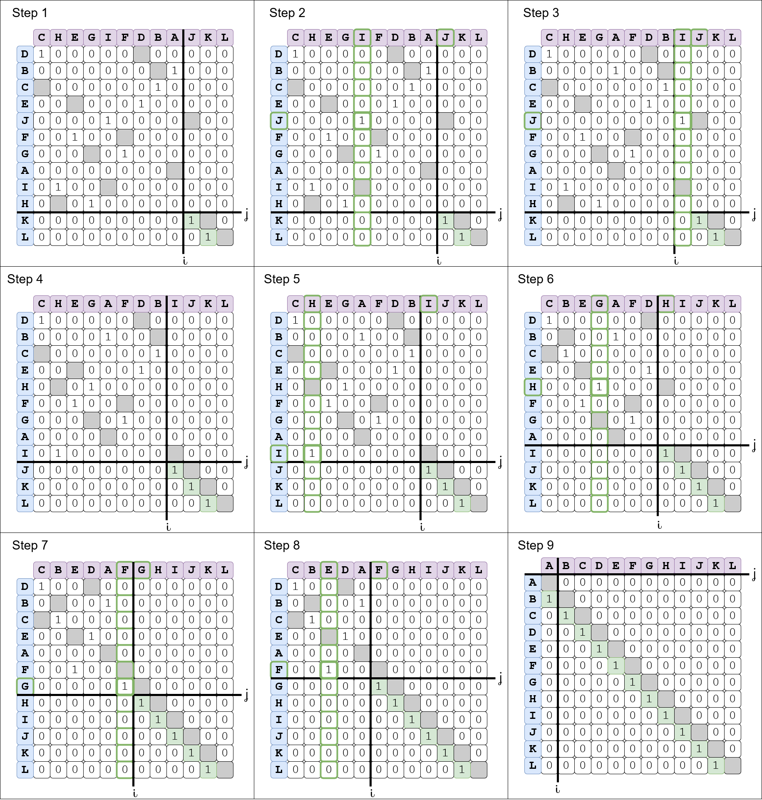

# Sequitur

Sequitur is an experimental genome assembler that blends De Bruijn-graph efficiency
with overlap-layout-consensus accuracy, using suffix arrays for efficient overlap detection
and bipartite matching for optimal read ordering.

**Current Status**: Production-ready Rust implementation with optional Python bindings.
Python reference implementation maintained for educational purposes and prototyping.



## Features

- **Efficient overlap detection** via decorated suffix arrays
- **Optimal read ordering** using bipartite maximum matching
- **Quality-aware assembly** with per-base quality score resolution
- **Alternative path detection** for identifying ambiguous assembly regions ([docs](docs/ALTERNATIVE_PATHS.md))
- **High performance** Rust implementation with Python bindings (30x faster than pure Python)

## Repository Structure

```
.
├── rust/               # Primary implementation (Rust)
│   ├── src/
│   │   ├── main.rs           # CLI entrypoint
│   │   ├── lib.rs            # Library exports
│   │   ├── suffix.rs         # Suffix array construction
│   │   ├── overlap.rs        # Overlap detection
│   │   ├── matching.rs       # Bipartite matching & assembly
│   │   ├── alternative_paths.rs  # Swap-square analysis
│   │   └── python_bindings.rs    # PyO3 Python interface
│   └── README.md
├── python/             # Reference implementation & notebooks
│   ├── sequitur.py           # CLI wrapper (uses Rust if available)
│   ├── sequitur_core/        # Pure Python implementation (deprecated)
│   ├── examples/             # API usage examples
│   └── tests/
├── docs/               # Documentation (see docs/README.md)
│   ├── README.md             # Documentation index
│   ├── ALTERNATIVE_PATHS.md  # Alternative path detection guide
│   └── RUST_ARCHITECTURE.md  # Architecture and migration guide
├── tests/              # Integration test fixtures
└── images/             # Figures and diagrams
```

**📖 See [docs/README.md](docs/README.md) for complete documentation index.**

## Quick Start

### Rust CLI (Recommended)

```bash
cd rust
cargo build --release

# Run assembly
./target/release/sequitur_rs \
    ../tests/fixtures/reads1.fastq \
    ../tests/fixtures/reads2.fastq \
    --output-fasta results/assembled.fasta \
    --reference reference.fasta

# Detect alternative paths
./target/release/sequitur_rs \
    reads1.fastq reads2.fastq \
    --analyse-alternatives \
    --alternatives-json results/alternatives.json \
    --score-gap 5.0
```

See [rust/README.md](rust/README.md) for detailed CLI options and examples.

### Python with Rust Bindings

```bash
cd rust
pip install maturin
maturin develop --release
cd ../python

# Python CLI (uses Rust backend automatically)
python sequitur.py reads1.fastq reads2.fastq \
    --output-fasta results/assembled.fasta \
    --analyse-alternatives \
    --alternatives-json results/alternatives.json

# Unified synthetic dataset utilities (encode/generate/diagnose/validate/decode)
python ../scripts/synthetic/datasets_cli.py list
python ../scripts/synthetic/datasets_cli.py generate bee_movie
python ../scripts/synthetic/datasets_cli.py validate \
    tests/synthetic/bee_movie/data/reference.fasta \
    tests/synthetic/bee_movie/results/assembly.fasta
```

### Pure Python (Deprecated, Educational)

```bash
cd python
python -m venv .venv
source .venv/bin/activate
pip install numpy scipy biopython fastDamerauLevenshtein networkx

PYTHONPATH=. python sequitur.py \
    reads1.fastq reads2.fastq \
    --output-fasta results/assembled.fasta
```

⚠️ **Note**: Pure Python is 30x slower than Rust. Use for prototyping only.

## Documentation

- **[docs/README.md](docs/README.md)** – Complete documentation index
- **[docs/ALTERNATIVE_PATHS.md](docs/ALTERNATIVE_PATHS.md)** – Alternative path detection theory and usage
- **[docs/RUST_ARCHITECTURE.md](docs/RUST_ARCHITECTURE.md)** – Architecture rationale and migration guide
- **[python/README.md](python/README.md)** – Python implementation details
- **[rust/README.md](rust/README.md)** – Rust crate documentation
- **`scripts/synthetic/datasets_cli.py`** – Unified synthetic dataset CLI (replaces legacy per-function scripts)
- **`julian jacobs 1605267 masters dissertation.pdf`** – Original thesis with algorithm details

## Roadmap

✅ **Completed**:
- Suffix array construction and overlap detection
- Bipartite maximum matching for read ordering
- Quality-aware base resolution
- Alternative path detection via swap-square analysis
- Rust implementation with Python bindings
- Integration tests and benchmarks
- Consolidated dataset CLI (completed; deprecates multiple ad-hoc scripts)

🚧 **In Progress**:
- Performance optimization for large datasets
- Comprehensive benchmark suite
- CI/CD automation

📋 **Future**:
- Graph visualization tools
- Multi-threading for overlap construction
- Support for long reads (PacBio, Nanopore)

## Background

Sequitur combines:
1. **Suffix arrays** (from FM-index/BWT tradition) for O(n log n) overlap detection
2. **Bipartite matching** (Hungarian algorithm) for optimal read ordering
3. **Quality scores** for per-base conflict resolution

If you are new to the project:
1. Read the [dissertation PDF](julian%20jacobs%201605267%20masters%20dissertation.pdf) for algorithm details
2. Explore notebooks in `python/` for interactive walkthroughs
3. Try toy datasets (`tests/fixtures/`) before real FASTQ data

## Contributing

Contributions are welcome! Please:
1. Read [docs/RUST_ARCHITECTURE.md](docs/RUST_ARCHITECTURE.md) for architecture context
2. Follow coding guidelines in [.github/copilot-instructions.md](.github/copilot-instructions.md)
3. Add tests for new features (Rust: `cargo test`, Python: pytest)
4. Update relevant documentation in `docs/`

Open an issue or start a discussion before major changes.

## License

See repository for license details.
